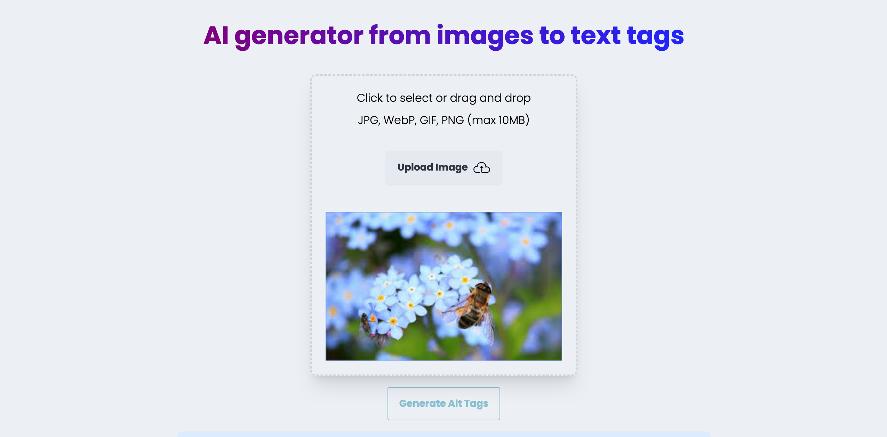

## AI Tags Generator

This is a project generates tags for images using Anthropic AI.

https://ai-tags-generator-2f15f70814fd.herokuapp.com/


## Getting Started

### Run locally

#### Cloning the repository the local machine.

```bash
git clone
```
#### Change .example.env to .env file
1. Create account on https://cloudinary.com/, and get cloudinary cloud name 
2. Go to settings --> upload, edit the Upload presets as unsigned, and get your cloudinary upload preset
3. Create account on https://console.anthropic.com/, and get your anthropic api key
4. Store all the configs in .env file

#### Installing the dependencies
```bash
npm install
```
#### Runing the development server:

```bash
npm run dev
```

Open [http://localhost:3000](http://localhost:3000) with your browser to see the result.


